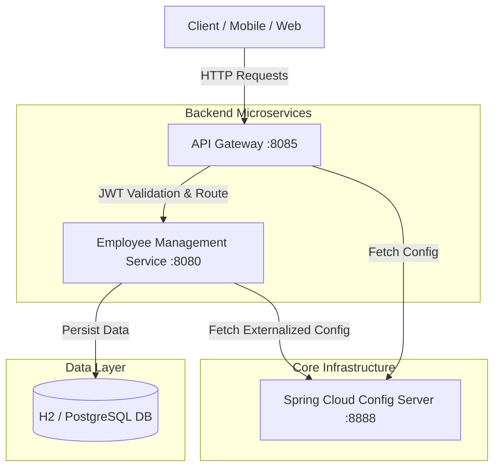

# 🏢 Microservices Employee Management Platform

[](https://www.oracle.com/java/)
[](https://spring.io/projects/spring-boot)
[](https://spring.io/projects/spring-cloud)
[](https://www.docker.com/)
[](LICENSE)

A modern, production-grade microservices-based backend for **Employee Management**, engineered using **Java 17**, **Spring Boot 3.4**, **Spring Cloud (Gateway & Config Server)**, **Spring Security**, and **JWT Authentication**. Designed for enterprise scalability, seamless service routing, centralized configuration, containerized deployment, and high test coverage.

---

## 📐 System Architecture



---

## ✨ Features

- **🔐 Stateless Security & JWT Authentication**: Enterprise-grade Spring Security 6 integration with stateless JSON Web Tokens (JWT) for secure user login and registration.
- **🛡️ Role-Based Access Control (RBAC)**: Fine-grained access management (e.g., `ROLE_USER`, `ROLE_ADMIN`).
- **🌐 Spring Cloud API Gateway**: Dynamic routing, header propagation, and cross-cutting authentication filter on port `8085`.
- **⚙️ Centralized Config Server**: Decoupled config properties dynamically served via Spring Cloud Config Server on port `8888`.
- **🐳 Full Containerization**: One-command cluster spinning using Docker & Docker Compose (`docker-compose.yml`) with automated health checks.
- **📊 Observability & Metrics**: Production monitoring with Spring Boot Actuator and JaCoCo code coverage integration.
- **⚡ Comprehensive REST API**: Standardized JSON request/response formats, DTO validations (`jakarta.validation`), and uniform error handling.

---

## 🛠️ Technology Stack

| Domain | Technologies |
| :--- | :--- |
| **Language & Runtime** | Java 17 (LTS) |
| **Framework** | Spring Boot 3.4.0 |
| **Microservices Cloud** | Spring Cloud Gateway, Spring Cloud Config Server (2024.0.0) |
| **Security** | Spring Security, JJWT (`0.12.6`), BCrypt Password Hashing |
| **Database & Persistence** | Spring Data JPA, Hibernate, H2 In-Memory Database |
| **Build & Tools** | Apache Maven, Lombok, JaCoCo Maven Plugin (`0.8.13`) |
| **DevOps & Containers** | Docker, Docker Compose, Multi-stage Dockerfiles |

---

## 📁 Repository Structure

```directory
Employee_Management/
├── api-gateway/              # Spring Cloud API Gateway Service (Port 8085)
│   ├── src/                  # Gateway routing & JWT Filter logic
│   └── Dockerfile            # Container definition for Gateway
├── config-server/            # Centralized Configuration Server (Port 8888)
│   ├── src/                  # Config Server bootstrappers & application properties
│   └── Dockerfile            # Container definition for Config Server
├── src/                      # Core Employee Management Service (Port 8080)
│   ├── main/java/.../
│   │   ├── config/           # Security & Application Configurations
│   │   ├── controller/       # Auth & Employee REST API Endpoints
│   │   ├── dto/              # Request & Response DTO Models
│   │   ├── entity/           # JPA Database Entities (AppUser, Employee)
│   │   ├── repository/       # Data Access Layer Repositories
│   │   ├── security/         # JwtFilter, JwtService, UserDetails implementation
│   │   └── service/          # Core Business Logic Layer
│   └── main/resources/       # Properties, SQL DDL scripts, & H2 Configs
├── docker-compose.yml        # Orchestration spec for local multi-container deployment
├── Dockerfile                # Core Service container spec
├── pom.xml                   # Maven Parent POM file
└── README.md                 # Project Documentation
```

---

## 🚀 Quick Start Guide

### Prerequisites
Make sure you have the following installed locally:
- [Java 17 JDK](https://www.oracle.com/java/technologies/downloads/#java17)
- [Maven 3.8+](https://maven.apache.org/)
- [Docker](https://www.docker.com/products/docker-desktop/) & [Docker Compose](https://docs.docker.com/compose/) (optional, for containerized run)

---

### Option 1: Running with Docker Compose (Recommended)

To launch the complete infrastructure (Config Server, Employee Service, and API Gateway) with full healthchecks:

 Running Locally via Maven

1. **Start the Config Server**:
   ```bash
   cd config-server
   ./mvnw spring-boot:run
   ```

2. **Start the Core Employee Service**:
   ```bash
   # From project root
   ./mvnw spring-boot:run
   ```

3. **Start the API Gateway**:
   ```bash
   cd api-gateway
   ./mvnw spring-boot:run
   ```

---

## 🔑 Environment Variables

The services can be configured using environment variables or external `.env` files:

| Variable | Description | Default Value |
| :--- | :--- | :--- |
| `SPRING_PROFILES_ACTIVE` | Active profile (`dev`, `docker`, `native`) | `native` / `docker` |
| `JWT_SECRET` | Secret key for JWT signing & verification | Base64-encoded secret key |
| `PORT` | Service port override | `8080` (Service), `8085` (Gateway) |

---

## 📖 API Documentation & Endpoints

All requests should ideally be routed through the **API Gateway** (`http://localhost:8085`).

### 🔑 Authentication Endpoints

| Method | Endpoint | Description | Access |
| :--- | :--- | :--- | :--- |
| `POST` | `/api/v1/auth/register` | Register a new user (`USER` or `ADMIN`) | Public |
| `POST` | `/api/v1/auth/login` | Authenticate user & receive JWT Bearer Token | Public |

#### 📥 Registration Request (`POST /api/v1/auth/register`)
```json
{
  "username": "john_doe",
  "password": "Password123!",
  "role": "ADMIN"
}
```

#### 📤 Auth Response
```json
{
  "token": "eyJhbGciOiJIUzI1NiJ9.eyJzdWIiOiJqb2huX2RvZSIs...",
  "role": "ADMIN",
  "message": "User registered successfully"
}
```

---

### 👤 Employee Endpoints

*Note: Requires `Authorization: Bearer <JWT_TOKEN>` header.*

| Method | Endpoint | Description | Allowed Roles |
| :--- | :--- | :--- | :--- |
| `GET` | `/api/v1/employees` | Fetch list of all employees | `USER`, `ADMIN` |
| `GET` | `/api/v1/employees/{id}` | Fetch employee details by ID | `USER`, `ADMIN` |
| `POST` | `/api/v1/employees` | Create a new employee record | `ADMIN` |
| `PUT` | `/api/v1/employees/{id}` | Update an existing employee record | `ADMIN` |
| `DELETE` | `/api/v1/employees/{id}` | Delete employee record by ID | `ADMIN` |

---

## 🧪 Testing & Code Coverage

Run unit & integration test suites with Maven:

```bash
# Run tests
./mvnw clean test

# Generate JaCoCo Code Coverage Report
./mvnw jacoco:report
```

The execution report will be automatically generated at:
`target/site/jacoco/index.html`

---

## 🛡️ Health & Monitoring

Each microservice exposes Spring Boot Actuator endpoints for system health and metrics:

- **Config Server Health**: `GET http://localhost:8888/actuator/health`
- **Employee Service Health**: `GET http://localhost:8080/actuator/health`
- **API Gateway Health**: `GET http://localhost:8085/actuator/health`

---

## 📄 License

Distributed under the MIT License. See `LICENSE` for more information.

---

## 🤝 Contributing

Contributions are welcome!
1. Fork the Project
2. Create your Feature Branch (`git checkout -b feature/AmazingFeature`)
3. Commit your Changes (`git commit -m 'Add some AmazingFeature'`)
4. Push to the Branch (`git push origin feature/AmazingFeature`)
5. Open a Pull Request
